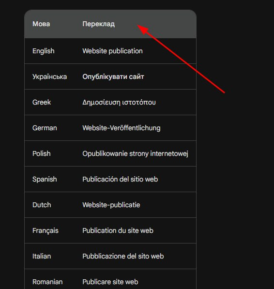

# Copy-data-from-the-AI-Bard-Table-and-transfer-it-to-the-JSON

1. Purpose: The purpose of this code is to extract data from Bard tables and convert it into JSON format.

2. Trigger Action: To initiate the data extraction, you should click on the table header (TH) in the table.

3. Execution Method:
  * You can inject this JavaScript code into a web page using a browser extension.
  * Alternatively, you can execute the code in the browser's console.
